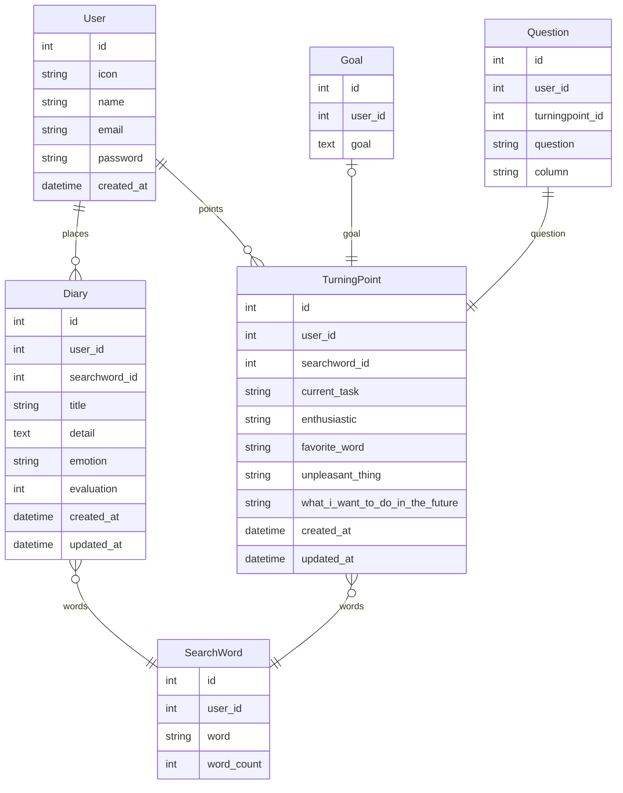

### 要件定義

https://www.notion.so/bdefce29c03f4f4a9f5da8b17949b5dd?v=3dab767a762d457489409cbd6622c83d&p=b8771c4e030649f19748a8b1eb14315a&pm=s

### 画面設計図

https://www.figma.com/file/JfyGOt4RHaIYomf17mnnnO/%E5%8E%9F%E4%BD%93%E9%A8%93?node-id=0-1&t=S2Hx2WOxNJ2FYZQ9-0

### ER 図

https://zenn.dev/yasuda/scraps/5b37805315215d

